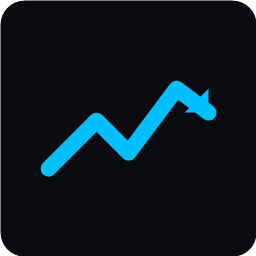
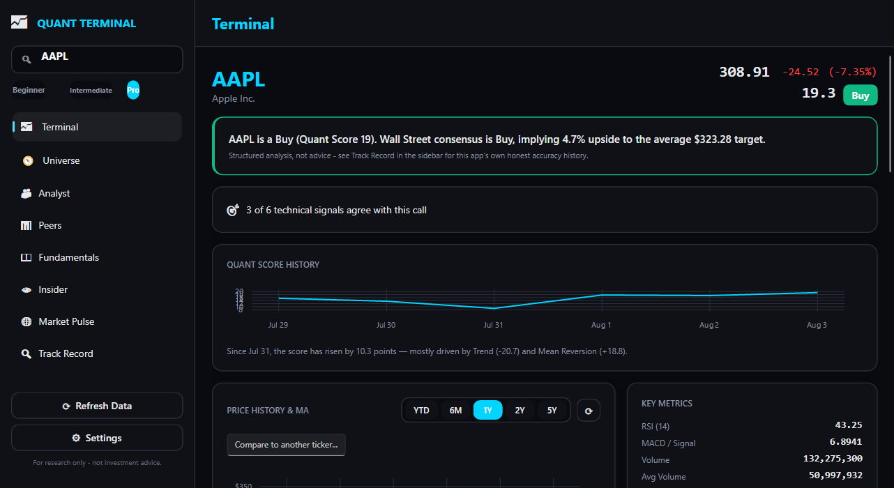
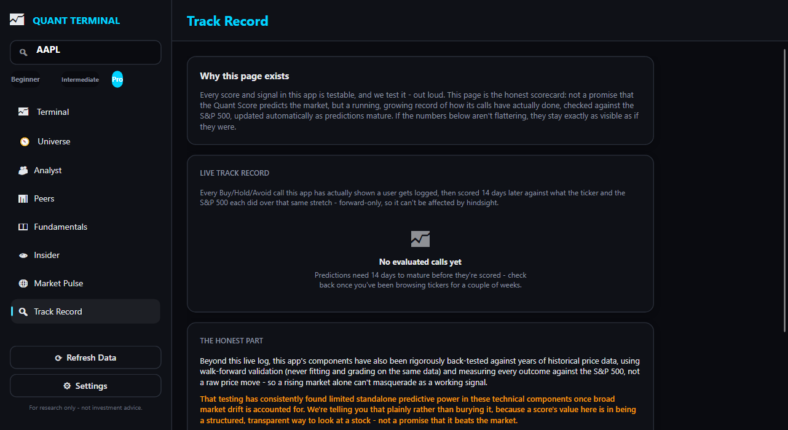
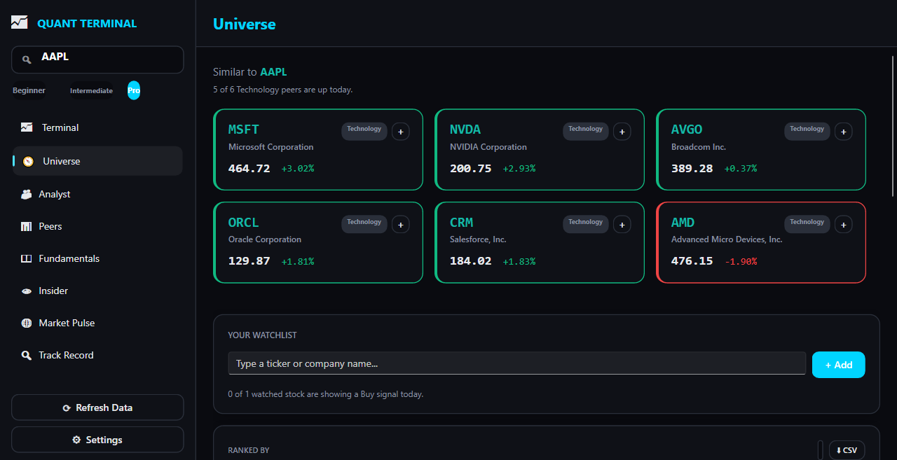
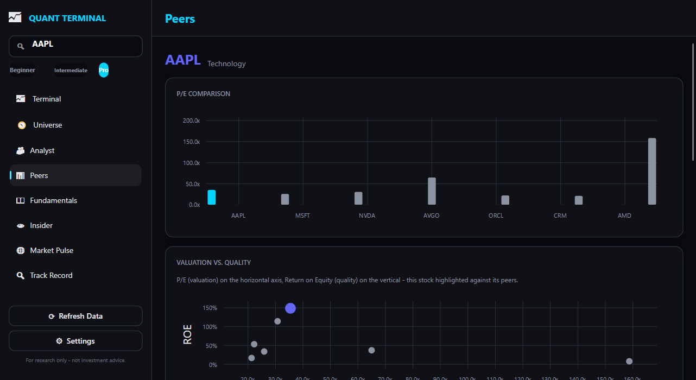

<div align="center">
  

  # Quant Terminal

  **A transparent, honestly-backtested stock research terminal for Windows.**

  [](https://github.com/viraajvashista3-tech/Quant-Hub/actions/workflows/ci.yml)
  [](LICENSE)
  
  
</div>

---

<p align="center">
  
  
</p>
<p align="center">
  
  
</p>

Quant Terminal is a native desktop app that pulls live market data and turns it into a
plain-English **Buy / Hold / Avoid** read on any stock — then shows you exactly how well
that read has actually done, instead of just asking you to trust it.

That last part is the whole point of this project. Most "quant signal" tools quietly assume
their own scoring works. This one **walk-forward backtests every component of its own score
against 5 years of history across 138 tickers, keeps a live forward-tested prediction log that
can't benefit from hindsight, and shows you the honest result** — including the parts that
didn't pan out — on a dedicated Track Record page.

## Why this exists

For research only — not investment advice. The goal isn't to convince you the model beats the
market. It's to be the kind of tool that would tell you if it didn't. Rigorous testing on this
project's own scoring components found most raw technical signals correlate weakly with forward
returns (see [`QuantHub.Core/Backtesting`](QuantHub.Core/Backtesting)) — that finding is surfaced
in the app, not hidden from it.

## Features

| Page | What it does |
|---|---|
| **Terminal** | Live Buy/Hold/Avoid quant score for any ticker, with a full breakdown (trend, momentum, MACD, volatility, mean reversion, relative strength) and news sentiment |
| **Universe** | Browse 138 tickers across 11 sectors; auto-refreshing Top 20 rankings by momentum, value, and quality |
| **Analyst** | Wall Street consensus rating, price targets (low/mean/high), and recent upgrades/downgrades |
| **Peers** | Sector peer comparison — relative performance, fundamentals table, correlation matrix |
| **Fundamentals** | P/E, EV/EBITDA, margins, balance sheet ratios, and a quarterly earnings surprise chart |
| **Insider** | Recent insider (Form 4) buy/sell activity |
| **Market Pulse** | Broad market breadth and sentiment snapshot |
| **Track Record** | The honesty page — live, forward-tested hit rate for every signal type, plus the methodology behind it |

Also included: a watchlist (add tickers from Universe, back it up to/from a JSON file in
Settings), light/dark theme with a configurable accent color, and a Beginner / Intermediate /
Pro difficulty mode that controls how much statistical detail each page shows.

## Under the hood

- **Quant score**: seven continuous technical/statistical signals, weighted and auto-recalibrated
  weekly against a walk-forward backtest so the weights track what's actually been predictive
  recently, not a fixed hand-tuned guess.
- **Backtesting engine**: OLS regression + walk-forward validation across the full ticker
  universe, labeling every sample by *excess return over the S&P 500* (not raw return) so market
  drift can't masquerade as edge.
- **Live prediction log**: every Terminal page view logs a timestamped, unfalsifiable
  prediction; matured entries (14+ days old) are scored automatically and rolled into the Track
  Record page.
- **Data source**: Yahoo Finance (no API key required), plus Google News RSS scored with VADER
  sentiment analysis.

## Getting started

### Download

Grab the latest installer or portable zip from the
[Releases page](https://github.com/viraajvashista3-tech/Quant-Hub/releases) — no .NET runtime
install required, no API keys to configure. Every tagged release is built and published
automatically by [`.github/workflows/release.yml`](.github/workflows/release.yml).

### Run from source

Requires the [.NET 8 SDK](https://dotnet.microsoft.com/download/dotnet/8.0) on Windows.

```powershell
git clone https://github.com/viraajvashista3-tech/Quant-Hub.git
cd Quant-Hub
dotnet run --project QuantHub.Desktop
```

### Build a standalone .exe

```powershell
dotnet publish QuantHub.Desktop -c Release -r win-x64
```

Produces a single self-contained `QuantTerminal.exe` — no .NET runtime install required on the
target machine — under `QuantHub.Desktop/bin/Release/net8.0/win-x64/publish/`.

### Run the tests

```powershell
dotnet test QuantHub.sln
```

## Architecture

```
QuantHub.Core/       Data + analysis engine - Yahoo Finance client, indicators, quant
                      scoring, backtesting. No UI dependencies; fully unit-testable.
QuantHub.Desktop/     Avalonia + FluentAvalonia UI (MVVM, CommunityToolkit.Mvvm).
QuantHub.Desktop.Tests/  xUnit test suite covering QuantHub.Core and view models.
```

`QuantHub.Core` has no dependency on Avalonia or any UI framework — the scoring/backtesting
engine is plain, testable C# that a future CLI, web API, or different UI shell could reuse as-is.

## Disclaimer

This tool is for research and educational purposes only. Nothing in this app is financial
advice, and past performance (including everything shown on the Track Record page) is not a
guarantee of future results.

## License

[MIT](LICENSE)
